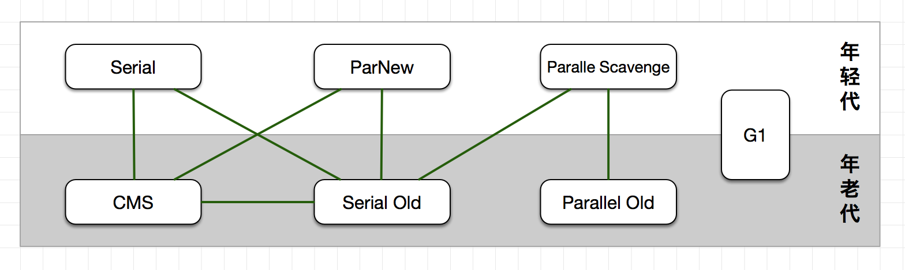

## 内存
### 内存区域划分
#### 运行时数据区域
- **程序计数器**: 可以看做当前线程锁执行的字节码的行号指示器, 每个线程有一个. 如果执行的是Native方法, 则为空
- **虚拟机栈**: 描述java方法运行时的内存模型. 线程私有, 生命周期与线程相同. 方法执行时会创建栈帧(Stack Frame)用于存储局部变量表, 操作数栈, 动态链接, 方法出口等信息. 该部分可能会抛出`StackOverflowError`(当栈深度超过JVM允许的深度时) 或 `OutOfMemoryError`(虚拟机栈动态扩展时无法申请到足够内存时)
    - **局部变量表**: 存放编译器可知的各种基本数据类型, 对象引用和returnAddress. long和double占用2个局部变量空间(slot), 其他的占用1个. 这段空间在编译期间完成了分配.<!-- more -->
- **本地方法栈**: 与虚拟机栈作用类型, 区别是本地方法栈调用的是Native方法, 而虚拟机栈调用的是Java方法(字节码). JVM规范中对本地方法栈使用的语言, 使用方式和数据结构并无约束, 虚拟机可以自己自由的实现, 有的虚拟机(如HotSpot)直接将本地方法栈和虚拟机栈合二为一. 本地方法栈也会抛出`StackOverflowError` 或 `OutOfMemoryError`.
- **堆**: JVM规范规定: 所有对象实例和数组都在堆内分配. 但随着JIT编译器的方法和逃逸分析技术的成熟, 栈上分配,标量替换优化技术导致这一规定变的不那么"绝对". 具体划分: 新生代 和 老年代, 新生代有分为 Eden, FromSurvivor 和 ToSurvivor空间. 从内存分配的角度看, 堆可能划分出多个线程私有的分配缓冲区(ThreadLocalAllocationBuffer, TLAB), 由于优化并发创建对象时, 内存分配同步问题. 该区域会抛出`OutOfMemoryError`.
- **方法区**: 线程共享, 用于存储已被JVM加载的类信息, 常量, 静态变量, JIT编译后的代码等. 方法区常被称作"永久代", 但本质上两者并不等价, 仅仅是因为HotSpot将GC分代收集扩展到方法区, 或者说使用永久代来实现方法区而已. 其他一些虚拟机(JRockit, IBM J9等)是不存在永久代的. JVM对方法区没有约束. JDK7已经将字符串常量从永久代移出, 放到了堆中. JDK8使用MetaSpace存放方法区内容, 并且用的是本地内存. 该区域会抛出`OutOfMemoryError`.
    - **运行时常量池**: 存放编译器生成的各种字面量和符号引用. 运行时也可存如新的常量(`String.intern()`). 
- **直接内存**: 不是JVM运行时数据区的一部分, 也不是JVM规范中定义的内存区域. 从JDK1.4开始, 可以通过NIO可以使用Native函数库直接分配堆外内存, 然后使用`DirectByteBuffer`引用. 避免在Java堆和Native堆中来回复制数据, 提高了性能. 

### 对象的创建
JVM遇到`new`指令时: 
1. 检查该指令的参数能否在常量池定位到一个符号引用, 并检查该符号引用代表的类是否已被加载, 解析和初始化过. 如果没有则执行类加载过程.
2. 为新生对象分配内存. 其所需内存在类加载后就已确定. 
    分配方式用两种: 指针碰撞 和 空闲列表. 如果内存是规整的, 一边是已分配内存, 一边是未分配内存, 那么分配内存时仅仅是移动作为分界点的指示器. 该方式称为"指针碰撞". 如果内存不是规整的, 则需要维护一个列表, 记录那些内存是可用的, 分配时从中找到一块足够大空间划分给对象实例. 该方式称为"空闲列表". 具体采用哪种方式, 取决于堆内存是否规整, 而堆内存是否规整又是由所采用的垃圾回收器是否带有压缩整理功能决定. 因此, 当采用`Serial`, `ParNew`等带Compact过程的收集器时, 系统使用的是"指针碰撞". 而使用`CMS`这种基于Mark-Sweep算法的收集器时, 通常采用的是空闲列表. 
    因为对象创建十分频繁, 为保证并发时的线程安全, 有两种方案可用: 1. 虚拟机采用CAS+失败重试保证内存分配的原子性; 2. 为每个线程预先在堆上分配一小块内存, 称为本地线程分配缓冲(Thread Local Allocation Buffer, TLAB), 线程首先在TLAB上分配内存, 用完重新分配TLAB时才同步锁定. 可以通过`-XX:+/-UseTLAB`设定是否使用TLAB.
3. 将分配到内存空间都初始化为零(不包括对象头). 如果使用TLAB, 该工作也可以提前至TLAB分配是进行.
4. JVM对对象进行必要的设置, 如对象头: MarkWord, 类型指针(属于哪个类) 和 数组长度(如果当前对象时数据的话)
5. 至此, 对于JVM来说, 一个新的对象已经生成. 但对于程序来说, 创建才刚开始 --- `<init>`方法还没执行, 所有字段都还为零. 一般new指令后会接着执行`<init>`方法(根据字节码中是否跟随`invokespecial`指令决定), 将对象按程序员的意图进行初始化.
> 可参考`hotspot.src.share.vm.interpreter.bytecodeInterpreter.cpp:1966`, 版本:openjdk-8-src-b132. 虽然该解释器很少用, 但用于理解HotSpot运行过程没问题.

### 对象的内存分布
> HotSpot中, 对象的内存分布有三个区域: **对象头**, **实例数据** 和 **对齐填充**.

#### 对象头
包含两部分信息: "Mark Word" 和 类型指针. 
- **Mark Word**: 用于存储对象自身的运行时数据, 如: 哈希码, GC分代年龄, 锁状态标志, 线程持有的锁, 偏向线程ID, 偏向时间戳等. 在32位和64位虚拟机中(未开启指针压缩), 其长度分别是32bit和64bit. 对象需要存储的运行时数据其实已经超过32位或64位, 但由于对象头数据是与对象自身定义的数据无关的额外存储成本, 为了虚拟机空间的效率, MarkWord被设计成一个非固定的数据结构以便在极小的空间存储尽量多的信息. 它会根据对象状态复用自己的存储空间. 例如, 在32位虚拟机内, 如果对象未被锁定, 则使用25bit存储HashCode, 4bit存储分代年龄, 2bit存储锁标志, 1bit固定为0, 其他状态(轻量级锁定, 重量级锁定, GC标记, 可偏向)下的Mark Word存储内容如下:

| 存储内容 | 标志位 | 状态 |
|:------:|:-------:|:----:|
| 对象哈希码, 分代年龄 | 01 | 未锁定 |
| 指向锁记录的指针 | 00 | 轻量级锁定 |
| 执行重量级锁的指针 | 10 | 膨胀(重量级锁定) |
| 空, 不需要记录信息 | 11 | GC标记 |
| 偏向线程ID, 偏向时间戳, 对象分代年龄 | 01 | 可偏向 |

- **类型指针**: 对象指向它的类元数据的指针, 通过该指针确定对象属于哪个类的实例. 
- **数组长度**: 如果对象时数组时, 记录数组长度.
> 可参考`hotspot.src.share.vm.oops.markOop.hpp`的注释, 它说明了对象头组成, 版本:openjdk-8-src-b132. 
```c++
// Bit-format of an object header (most significant first, big endian layout below):
//
//  32 bits:
//  --------
//             hash:25 ------------>| age:4    biased_lock:1 lock:2 (normal object)
//             JavaThread*:23 epoch:2 age:4    biased_lock:1 lock:2 (biased object)
//             size:32 ------------------------------------------>| (CMS free block)
//             PromotedObject*:29 ---------->| promo_bits:3 ----->| (CMS promoted object)
//
//  64 bits:
//  --------
//  unused:25 hash:31 -->| unused:1   age:4    biased_lock:1 lock:2 (normal object)
//  JavaThread*:54 epoch:2 unused:1   age:4    biased_lock:1 lock:2 (biased object)
//  PromotedObject*:61 --------------------->| promo_bits:3 ----->| (CMS promoted object)
//  size:64 ----------------------------------------------------->| (CMS free block)
//
//  unused:25 hash:31 -->| cms_free:1 age:4    biased_lock:1 lock:2 (COOPs && normal object)
//  JavaThread*:54 epoch:2 cms_free:1 age:4    biased_lock:1 lock:2 (COOPs && biased object)
//  narrowOop:32 unused:24 cms_free:1 unused:4 promo_bits:3 ----->| (COOPs && CMS promoted object)
//  unused:21 size:35 -->| cms_free:1 unused:7 ------------------>| (COOPs && CMS free block)
```

#### 实例数据
用于存储对象的有效信息, 无论是父类中继承的, 还是自己定义的. 这部分的存储顺序会受到虚拟机分配策略参数(FieldsAllocationStyle)和字段在源码中定义的顺序影响. HotSpot默认的分配策略是: **longs/doubles**, **ints**, **shorts/chars**, **bytes/booleans**, **oops(Ordinary Object Pointers)**, 相同宽度的字段总是被分配到一起. 因此父类定义的变量会出现在自己定义的变量之前. 如果`CompactFields`参数为`True`(默认true), 自己的较窄的变量有可能插入父类变量的空隙中.

#### 填充数据
不是必然存在, 也没特殊含义, 仅起到占位作用. HotSpot的自动内存管理要求**对象起始地址必须是8字节的整数倍**, 即对象大小必须是8字节的整数倍, 对象头是8字节整数倍, 所以如果实例部分数据如果没有对齐, 则需要通过对齐填充补全.

#### 对象的访问定位
Java程序通过栈上的reference数据来操作堆上的具体对象, 但reference类型在JVM规范中仅规定了一个指向对象的引用, 没有定义该引用以何种方式定位, 访问堆中的对象的具体位置. 目前不同虚拟机主要使用**句柄**和**直接指针**来访问.
- **句柄**: 堆中划分一块内存用作句柄池, reference中存储的是对象的句柄地址, 句柄中又包含了对象的实例数据和类型数据的地址信息. 好处: reference中存储的是稳定的句柄的地址, 对象移动时(垃圾回收时很常见)只改变句柄中的实例数据指针, 而reference本身不需要修改; 
- **指针**: reference中存储的就是对象地址(对象头再指向所属的类型). 好处: 速度快, 节省了一次指针定位的时间开销, 由于对象访问十分频繁, 因此该类开销累积后也是很可观的. **HotSpot采用的是这种方式**

## GC
### 对象引用
判断一个对象是否存活: 
1. **引用计数法**: 难以解决互相引用的问题, python使用了该算法(通过标记-清除解决循环引用)
2. **可达性分析算法**: Java, C#, Lisp都采用该算法. 基本思想是通过一系列"GC Roots"的对象为起点, 往下搜索, 搜索经过的路径成为"引用链"(Reference Chain), 当一个对象到GC Roots没有任何引用链相连时, 则该对象不可用, 可以被回收.

    > Java中, 可作为GC Roots的对象包括:
    - 虚拟机栈(栈帧中的本地变量表)中引用的对象
    - 方法区中类静态变量属性引用的对象
    - 方法区中常量引用的对象
    - 本地方法栈中的JNI(即一般说的Native方法)引用的对象

#### 4种引用
JDK1.2之前, 如果reference类型的数据中存储的数值代表的是另一块内存的起始地址, 则称这块内存代表着一个引用. 这种定义下, 一个对象只有被引用和没被引用两种状态. JDK1.2之后对引用进行了扩充, 用以实现: 当内存空间足够时, 保留对象在内存中; 如果内存空间在GC后依然紧张, 就回收这部分对象.
- **强引用(Strong Reference)**: 程序代码中普遍存在, 只要强引用存在, 垃圾回收器就永远不会回收掉被引用的对象.
- **软引用(Soft Reference)**: 在系统将要发生内存泄露前, 会把这些对象列入回收范围中进行第二次回收. 如果注册回收后还没有足够的内存, 则抛出内存溢出异常. JDK1.2之后, 提供了`SoftReference`类来实现弱引用.
- **弱引用(Weak Reference)**: 被弱引用关联的对象只能生存到下次GC发生之前. GC时无论内存是否足够, 都会回收被弱引用关联的对象. JDK1.2之后, 提供了`WeakReference`类来实现弱引用.`ThreadLocal`内有用到.
- **虚引用(Phantom Reference)**: 唯一目的是为了在该对象被回收前收到一个系统通知. 一个对象是否有虚引用的存在, 完全不会对其生存时间产生影响, 也无法通过虚引用获得一个对象实例. JDK1.2之后, 提供了`PhantomReference`类来实现弱引用.

如果一个对象不可达, 那它将第一次被标记并进行一次筛选, 筛选的目的是判断该对象有没有必要执行`finalize()`方法, 如果对象没有覆盖`finalize()`或者`finalize()`已经被JVM调用过, 则该对象的筛选结果是"没必要执行".
如果对象被判断有必要执行`finalize()`方法, 则该对象会被放在一个叫`F-Queue`的队列中, 并在稍后由一个虚拟机自动建立, 低优先级的Finalizer线程去执行它. 所谓"执行"是指虚拟机会触发该方法, 但不承诺会等待它允许结束. 这是为了防止`Finalize()`方法执行缓慢或死循环, 导致队列内其他对象永久处于等待, 甚至导致整个内存回收系统崩溃. `finalize()`是对象拯救自己的最后一次机会, 如果在`finalize()`中将自己重新与引用链上的任何一个对象建立关联关系, 那么在接下来的虚拟机第二次标记时, 它就会被移出F-Queue, 否则该对象基本就真的会被回收了.

#### 方法区回收
永久代回收"性价比"较低, 每次回收到的内存较少. 主要回收两部分内容: 废弃常量 和 无用的类.
废弃常量回收与堆中对象类似, 比如: 字符串"abc"已经进入常量池, 但当前系统内没有任何一个String对象引用这个字面量, 此时如果发生内存回收, 如果必要的话, 这个"abc"常量就会被清理出常量池. 常量池中其他类(接口), 方法, 字段的符号引用也与此类似.
判断一个类是否可被回收, 需满足3个条件:
1. 该类的所有实例都已被回收
2. 加载该类的ClassLoader已被回收
3. 该类对应的java.lang.Class对象没有在任何地方被引用, 无法在任何地方通过反射访问该类的方法.
满足上面3个条件仅表示类可以被回收, 但不一定必然被回收. 可以通过`-Xnoclassgc`控制是否回收类. 还以通过`-verbose:class`, `-XX:+TraceClassLoading`, `-XX:+TraceClassUnLoading`查看类的加载和卸载信息. 
在大量使用反射, 动态代理, CGLib等ByteCode框架, 动态生成JSP以及OSGI这类频繁自定义ClassLoader的场景都需要虚拟机具备卸载类的功能, 以保证永久代不会溢出.

### 垃圾回收算法
#### 标记-清除算法(Mark-Sweep)
这是最基础的收集算法, 算法分"标记"和"清除"两个阶段. 不足: 效率低, 标记和清除效率都不高; 清除后会产生大量内存碎片.

#### 复制算法
为解决效率问题, 复制算法将内存划分为相同大小的两块, 每次只使用其中一块. 当这一块的内存用完, 就将还存活的对象复制到另一块内存上, 然后把当前内存清空. 好处: 分配时无需考虑内存碎片, 仅需移动指针, 按顺序分配内存, 简单高效. 但每次只有一半内存可用. 现代商业虚拟机都采用该算法回收新生代. 
HotSpot采用Eden(80%)+Survivor(10%) * 2, 当回收的对象超过10%时会依赖老年代进行分配担保(Handler Promotion). 
#### 标记-整理算法(Mark-Compact)
复制算法在存活对象较多时需要进行较多的复制操作, 效率低. 老年代一般不采用该算法. 标记整理算法先标记, 然后不直接清理, 而是让所有存活的对象都向一端移动, 然后清理掉端边界以外的内存.
#### 分代收集算法(Generational Collection)
当前商业虚拟机都采用该算法, 划分年轻代, 老年代. 再根据不同代采用不同回收算法.

### HotSpot算法实现
#### 枚举根节点(GC Roots)
可作为RC Roots的对象主要在全局性引用(如:常量,类静态变量)和执行上下文(如:栈帧中的本地变量表)中, 逐个检查这些引用, 会很耗时. HotSpot使用一组称为"OopMap"的数据结构来记录引用. 在类加载完成的时候, HotSpot把对象内什么偏移量上是什么类型的数据计算出来, 在JIT编译过程中, 也会在特定位置记录下栈和寄存器中哪些位置是引用. 这样GC在扫描时就可以直接得知这些信息了.
#### 安全点
在OopMap帮助下, HotSpot可以快速且准确地完成GC Roots枚举, 但HotSpot并没有为每条指令都生成OopMap, 而是在"特定的位置"记录, 这些位置称为"安全点(Safepoint)". 即程序不是随时都能停下来开始GC, 只有到达安全点是才能暂停. Safepoint不能太少以致于让GC等待时间太长, 有不能太多以致于增加运行时负担. 另一个要考虑的是如何在GC发生时让所有线程(不包括执行JNI调用的线程)都"跑"到最近的安全点上再停顿下来.
#### 安全区域(SafeRegion)
Safepoint机制保证了程序执行时, 在不长时间内就会遇到可进入GC的Safepoint. 但如果程序一直"不执行"呢? 比如线程一直处于Sleep或Blocked状态, 线程无法响应JVM中断请求, 此时需要"安全区域"来解决.
安全区域是指在一段代码片段中, 引用关系不会发生变化. 在改区域内如何位置开始GC都是安全的. 可以把安全区域看做是被扩展了的安全点.

### 垃圾回收器

连线表示两者可搭配使用

#### Serial收集器
最基本, 存在最长的收集器, 在JDK1.3之前是新生代收集的唯一选择. 这是一个单线程收集器. 使用复制算法.
#### ParNew收集器
Serial收集器的多线程版本, 包括Serial收集器可用的所有控制参数(如: `-XX:SurvivorRation`, `-XX:PretenureSizeThreshold`, `--XX:HandlePromotionFailure`等), 收集算法, Stop The World, 对象分配规则, 回收策略等都一致. 使用`-XX:+UseConcMarkSweepGC`后默认的新生代收集器, 也可以使用`-XX:+UseParNewGC`来强制使用它. 默认开启的收集线程数与CPU的数量相同, 可以使用`-XX:ParallelGCThreads`指定垃圾手机的线程数. 使用复制算法.
#### Parallel Scavenge收集器
使用复制算法, 多线程收集. CMS等收集器关注的是尽可能缩短垃圾收集是用户线程的停顿时间, 而Parallel Scavenge的目标则是达到一个可控制的吞吐量(Throughput, CPU运行用户代码时间/(运行用户代码时间+垃圾回收时间)). 
#### Serial Old收集器
使用标记-整理算法

#### Parallel Old收集器
使用标记-整理算法, JDK1.6才提供的

#### CMS收集器
以获取最短停顿时间为目标的收集器. 使用标记-清除算法. 整个过程分为4步:
- **初始标记**(CMS initial mark)
    **需要"stop-the-world"**, 仅标记一下GC Roots能*直接*关联到的对象, 速度很快
- **并发标记**(CMS concurrent mark)
    该阶段就是进行GC Roots Tracing的过程
- **重新标记**(CMS remark)
    **需要"stop-the-world"**, 该阶段是为了修正并发标记期间因为用户程序继续运行而导致标记产生变动的那一部分对象的标记记录, 该阶段的停顿时间一般比初始标记阶段的时间稍长一些, 但远比并发标记的时间短.
- **并发清除**(CMS concurrent sweep)

该收集器有3个明显的缺点:
- 对CPU资源特别敏感. 在并发阶段, 虽不会导致用户线程停顿, 但会因为占用部分系统资源到导致程序变慢, 总吞吐量会降低. CMS默认开启的回收线程数是(cpu数量 + 3)/4. 当CPU不足4个时, 为了减少GC线程的独占时间, 会在并发标记,清理时让GC线程和用户线程交替运行. 但效果不明显, 不提倡用户使用.
- CMS无法处理浮动垃圾(Floating Garbage), 可能会出现"Concurrent Mode Failure"失败而导致另一次Full GC产生. 在CMS并发清理阶段用户线程还在运行, 新的垃圾不断产生, 这部分垃圾出现在标记过程之后, CMS无法在当次收集中处理掉它们, 只好留待下一次GC时清理, 这部分垃圾就称为"浮动垃圾". 也是因为垃圾收集阶段用户线程还在运行, 所以CMS不能像其他收集那样等到老年代几乎完全填满了再进行收集, 需要预留一部分空间供并发收集时的程序使用. JDK1.6默认当老年代使用了92%的空间就会激活收集器. 可以通过`-XX:CMSInitiatingOccupancyFraction`来控制启动阈值. 要是CMS运气期间预留的空间无法满足程序需要, 就会出现一次"Concurrent Mode Failure"失败, 这时虚拟机会启动临时方案: 临时启动Serial Old收集器来收集老年代, 这样停顿时间很长.
- CMS是基于"标记-清除"算法的, 意味着会产生大量的内存碎片. 为解决该问题, CMS提供了`-XX:+UseCMSCompactAtFullCollection`开关参数(默认开启)来控制内存碎片的合并整理. `-XX:CMSFullGCsBeforeCompaction`该参数可以控制执行多少次(默认为0, 每次都压缩)不压缩的Full GC后来一次带压缩的.

#### G1收集器
JDK1.6u14就开始有Early Access版本的G1收集器供开发人员实验, 到JDK7u4才移除"Experimental"标记.

特点:
- 并行与并发
- 分代收集
- 空间整合: 不会产生空间碎片
- 可预测的停顿
G1将内存划分成多个大小相同的独立区域(Region), 虽然还保留年轻代和老年代的概念, 但它们不再是物理隔离的, 它们都是一部分Region(不需要连续)的集合.
G1会跟踪各个Region里的垃圾堆积的价值大小(回收所获得的空间和所需耗时的经验值), 在后台维护一个优先列表. 每次根据允许的收集时间, 优先回收价值最大的Region, 做到停顿时间可预测.
G1的运行步骤大致有:
- 初始标记(Initial Marking)
- 并发标记(Concurrent Marking)
- 最终标记(Final Marking)
- 筛选回收(Live Data Counting and Evacuation)

> 验证不同命令下JVM使用收集器, jvisualvm下查看MBeans->java.lang->GarbageCollector
默认情况下(JDK1.7/1.8)使用的是`PS Scavenge` + `PS MarkSweep`
`-XX:+UseConcMarkSweepGC`: ParNew + CMS

| GC shortname | Generation | Command line parameter | Comment |
|:------:|:-------:|:----:|:----:|
| Copy | Young | -XX:+UseSerialGC | The Copying collector |
| MarkSweepCompact | Tenured | -XX:+UseSerialGC | The Mark and Sweep Compactor |
| ConcurrentMarkSweep | Tenured | -XX:+UseConcMarkSweepGC | The Concurrent Mark and weep Compactor |
| ParNew | Young | -XX:+UseParNewGC |The parallel Young Generation Collector — can nly be used with the Concurrent mark and sweep compactor. |
| PS Scavenge | Young | -XX:+UseParallelGC | The parallel object scavenger |
| PS MarkSweep | Tenured | -XX:+UseParallelGC | The parallel mark and sweep collector |

### 内存分配和回收策略
对象的内存分配, 大方向上, 是在堆上分配(也可能经过JIT编译后被拆散为标量类型并间接在栈上分配), 对象主要在新生代的Eden上分配, 如果启动了本地线程分配缓冲, 将按线程优先在TLAB上分配. 少数情况下可以直接在老年代分配. 
**大对象直接进老年代**, 通过`-XX:PretenureSizeThreshold`参数控制, 大于该设置值的对象直接在老年代分配, 不过该参数只对Serial和ParNew两个收集器生效. 
**长期存活的对象进入老年代**, `-XX:MaxTenuringThreshold`参数控制进入老年代的对象年龄阈值, 默认为15.
**对象年龄动态判断**, 并不是对象年龄必须达到阈值才能进入老年代, 如果Survivor空间中相同年龄的所有对象大小的总和超过Survivor空间的一半, 年龄大于或等于该年龄的对象可以直接进入老年代, 无需等到MaxTenuringThreshold要求的年龄.
**空间分配担保**, 在Minor GC前, 虚拟机会检查老年代最大可用的连续空间是否大于新生代所有对象的总空间, 如果条件成立, 那么Minor GC是安全的. 如果不成立, 虚拟机则会查看HandlePromotionFailure参数值是否允许担保失败, 如果允许, 则会继续检查老年代最大可用连续空间是否大于历次晋升到老年代对象的平均大小, 如果大于就尝试着进行一次Minor GC(尽管是有风险的), 如果小于, 或者HandlePromotionFailure不允许冒险, 那此时会改为进行一次Full GC.

### 命令行工具
> ```bash
> # 检查线程情况
> top -H -p pid
> ```

#### jps
需要使用jvm所属用户执行, `sudo -u xxx jps`
```bash
jps -v
```

#### jmap
```bash
jmap -dump:format=b,file=xx.bin
# 触发full gc, jmap -histo不会
jmap -histo:live
# 使用jvm所属用户执行, 否则可能会失败
sudo -u nobody jmap -dump:format=b,file=xx.bin
```

```bash
# 每隔3秒打印GC内存情况
jstat -gcutil pid 3s
```


### jcmd

- 查看JVM进程内存分布

  增加JVM参数`-XX:NativeMemoryTracking=summary`, 启动后执行

  ```bash
  $ jcmd 29522 VM.native_memory summary
  29522:
  
  Native Memory Tracking:
  
  Total: reserved=2598660KB, committed=2536964KB
  -                 Java Heap (reserved=2097152KB, committed=2097152KB)
                              (mmap: reserved=2097152KB, committed=2097152KB)
  
  -                     Class (reserved=122308KB, committed=64708KB)
                              (classes #11692)
                              (malloc=1476KB #20250)
                              (mmap: reserved=120832KB, committed=63232KB)
  
  -                    Thread (reserved=65524KB, committed=65524KB)
                              (thread #83)
                              (stack: reserved=65168KB, committed=65168KB)
                              (malloc=259KB #428)
                              (arena=97KB #165)
  
  -                      Code (reserved=138968KB, committed=138968KB)
                              (malloc=5848KB #7597)
                              (mmap: reserved=133120KB, committed=133120KB)
  
  -                        GC (reserved=140938KB, committed=140938KB)
                              (malloc=30346KB #8883)
                              (mmap: reserved=110592KB, committed=110592KB)
  
  -                  Compiler (reserved=213KB, committed=213KB)
                              (malloc=82KB #266)
                              (arena=131KB #3)
  
  -                  Internal (reserved=11497KB, committed=11497KB)
                              (malloc=11465KB #38118)
                              (mmap: reserved=32KB, committed=32KB)
  
  -                    Symbol (reserved=14611KB, committed=14611KB)
                              (malloc=12493KB #123906)
                              (arena=2118KB #1)
  
  -    Native Memory Tracking (reserved=3136KB, committed=3136KB)
                              (malloc=13KB #153)
                              (tracking overhead=3123KB)
  
  -               Arena Chunk (reserved=218KB, committed=218KB)
                              (malloc=218KB)
  
  -                   Unknown (reserved=4096KB, committed=0KB)
                              (mmap: reserved=4096KB, committed=0KB)
  ```

  